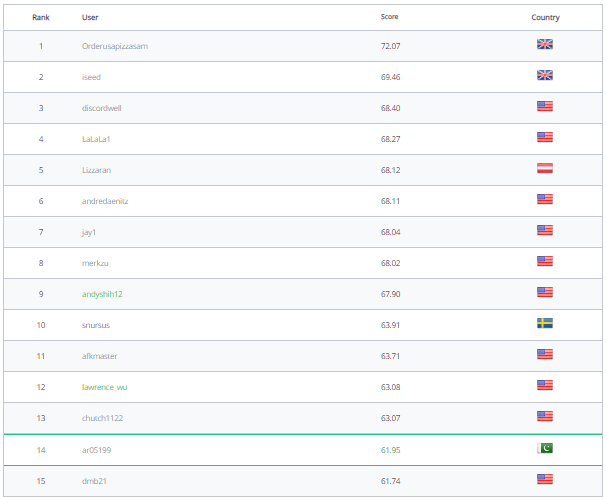

# Bidding-Game-Challenge-by-Twitch

## Description:

- A Hackerrank challenge to play a bidding game against other players.
- Secured 14th position worldwide out of 500+ submissions. (username: ar05199)

## Problem Statement:

```
0-1-2-3-4-S-6-7-8-9-10
P1                  P2
```

Two players are at the opposite end of the straight line as shown in the picture above. An expensive scotch (S) is kept in the middle at position #5. The players start the game with 100 dollars in hand.

The first player makes a secret bid followed by a secret bid by the second player. The bottle moves one position closer to the winning bidder. In the event of the same bid, the bottle moves closer to the player who has the draw advantage. Draw advantage initially starts with the first player, and it alternates every time a draw is encountered i.e., The first draw is won by the first player. The second draw if it occurs is won by the second player and so on.. The winning bid is deducted from the player's hand, the loser keeps his bid. Each bid must be greater than 0 dollar. In the case when there's no money left, the player has no choice but to bid 0 dollar. Only integral bids are allowed.

How is the result of the game determined?
The player who gets the bottle wins. If no one gets it, the game ends in a draw.

The function calculate_bid takes in 4 parameters - an integer player, the position of the scotch pos, an array first_moves that contains the previous bids made by player 1 and an array second_moves that contains the previous bids made by player 2. Complete the function to return an integer which is your next bid amount.

## Leaderboard:



## Demo:


